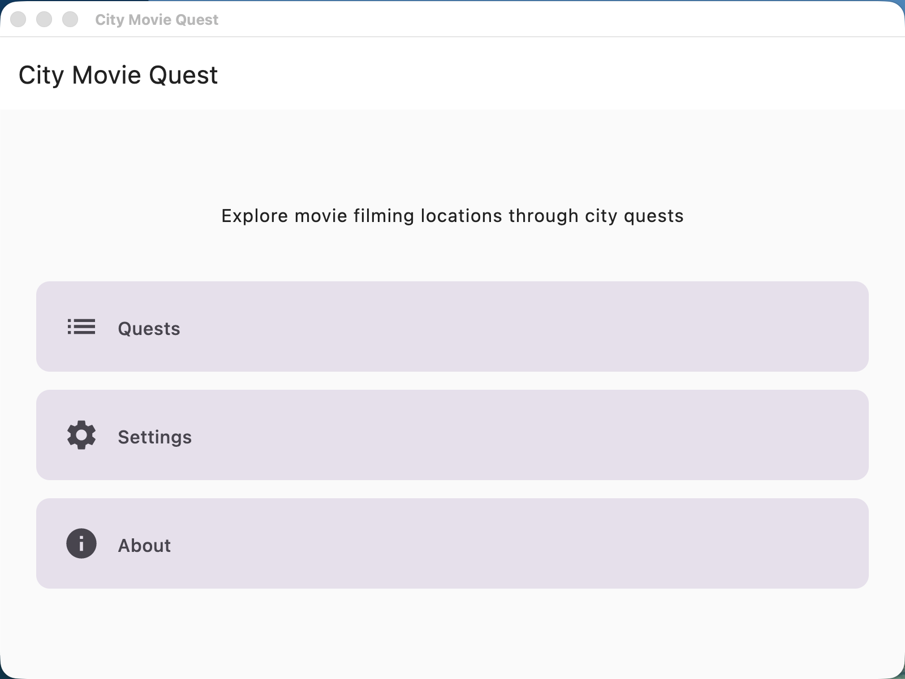
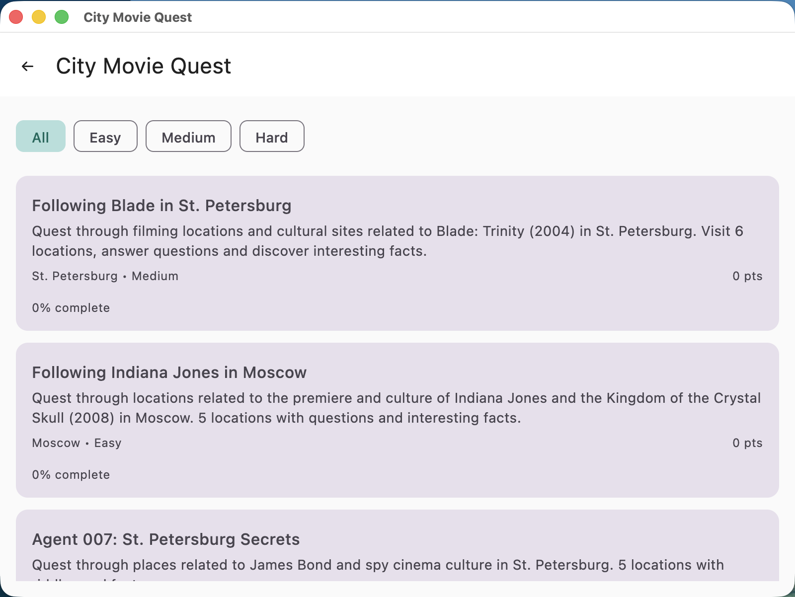
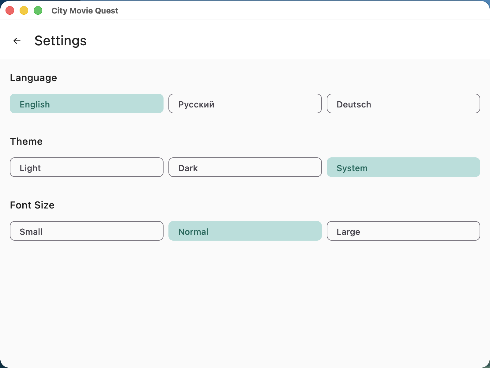
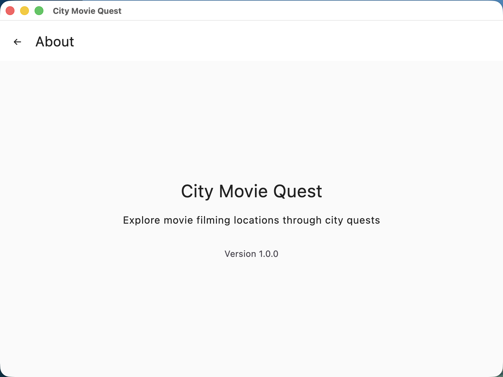

# City Movie Quest

A Kotlin Multiplatform (KMP) app for exploring movie filming locations through city quests. Entire UI built with Compose Multiplatform.

## Screenshots

### Main Menu


### Quests Catalog


### Settings


### About


## Stack

- **Language:** Kotlin 1.9.22
- **UI:** Compose Multiplatform 1.6.1
- **Database:** SQLDelight 2.0.1
- **Serialization:** Kotlinx Serialization 1.6.3
- **Target platforms:** Android, Desktop (JVM), Web (JS)

## Features

- **9 movie quests** across 3 difficulty levels (Easy, Medium, Hard)
- **3 task types:** Quiz, Count, Fact or Fiction
- **Multilingual:** English, Russian, German
- **Settings:** Language, Theme (Light/Dark), Font Size
- **Progress tracking** with score and attempt counting
- **IMDb facts** for each task

## Project Structure

```
quest-city/
├── shared/                    # Shared module (all logic and UI)
│   └── src/
│       ├── commonMain/        # Shared code
│       ├── androidMain/       # Android-specific code
│       ├── desktopMain/       # Desktop-specific code
│       └── jsMain/            # Web-specific code
├── app-android/               # Android app
├── app-desktop/               # Desktop app
└── app-web/                   # Web app
```

## Running

### Android
```bash
JAVA_HOME=/path/to/jdk17 ./gradlew :app-android:installDebug
```

### Desktop
```bash
JAVA_HOME=/opt/homebrew/opt/openjdk@21 ./gradlew :app-desktop:run
```

### Web
```bash
JAVA_HOME=/opt/homebrew/opt/openjdk@21 ./gradlew :app-web:jsBrowserDevelopmentRun
```

> **Note:** JDK 21 is required. The default system JDK (26) is not compatible with Kotlin 1.9.22.

## Quests

| Quest | Difficulty | City | Tasks |
|-------|------------|------|-------|
| Following Blade in St. Petersburg | Medium | St. Petersburg | 6 |
| Following Indiana Jones in Moscow | Easy | Moscow | 5 |
| Agent 007: St. Petersburg Secrets | Hard | St. Petersburg | 5 |
| Following The Matrix in Moscow | Easy | Moscow | 5 |
| Titanic: St. Petersburg Mysteries | Easy | St. Petersburg | 5 |
| John Wick: Moscow Protocol | Medium | Moscow | 5 |
| Harry Potter: London Magic | Medium | London | 5 |
| Inception: Dreams Across Cities | Hard | Multiple | 5 |
| The Dark Knight: Gotham Chronicles | Hard | Multiple | 5 |

## Adding a New Quest

1. Create a JSON file in `shared/src/commonMain/composeResources/files/`
2. Follow the format from existing quest files
3. Add the filename to the quest list in `Main.kt`
4. For Android: also copy to `app-android/src/main/assets/files/`

## License

MIT License — see [LICENSE](LICENSE).
